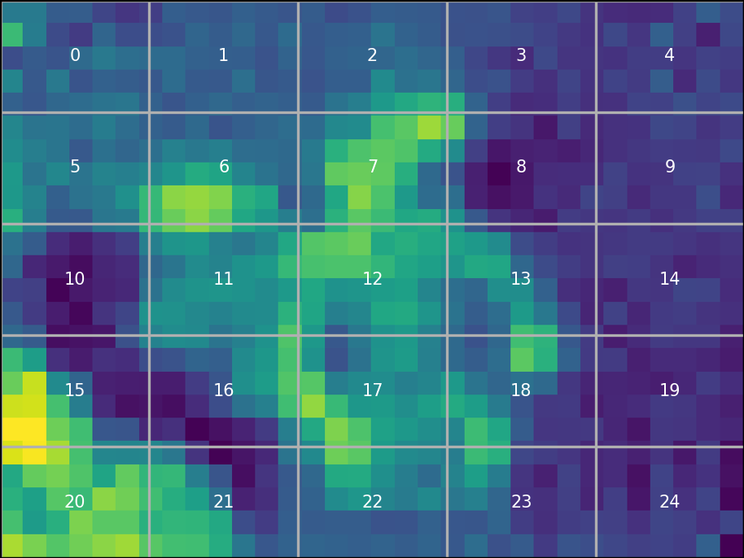

# thermal_image_analysis
透過grid方法來簡化熱成像的資料取樣
<!--  -->

## TODO:
1. 測試網格方法中最佳step  (或靠algorithm)
2. 取出格子中的local maximum，以及一個整體的global maximum (或以array-like方式進行)
3. 透過Algorithm將一張張圖片萃取出溫度資訊，成為曲線
4. 設計detector來偵測疲勞駕駛 (二次曲線)

這個點曾被經過
隨時間遞減(LSTM)

GTX1080
